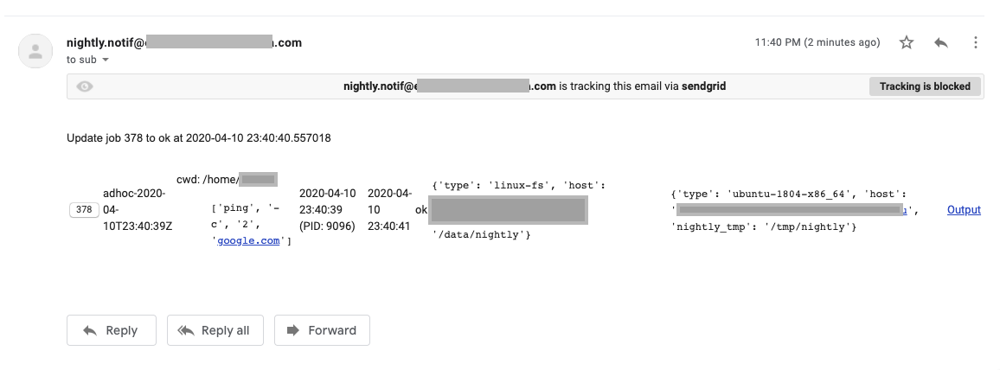

Nightly
=======


## Introduction

Nightly is a system for scheduling, monitoring and collecting outputs from configuration-defined
command-line tasks. It is developed to support my daily research work since I can't find an existing
solution that is lightweight (depends on nothing more than python, mysql and ssh) and
customizable (written in less than a few hundreds lines of Python in total). 
I hope it might be useful to you as well.

Data objects:

- Job
- Resource

Components:

- Log DB: database containing job log (status) entries
- Scheduler: master node
- Runner: launch job on runner node through SSH
- Storage: persisting job output and selected files
- Panel: web panel daemon
- Notif: notification (only email for now)

## Dependencies

```
poetry shell # get poetry: https://python-poetry.org/
poetry install
# symblink the virtual env created by poetry to `.venv` under project root as well
```

## Config

There should be two files inside `config` folder, which is ignored by git.
See `example_config` for examples and comments.

Users can use different `config` folders in different environment (production or development).

See https://app.sendgrid.com/guide/integrate/langs/python for email notification configuration keys
`sendgrid_api_key`, `notif_sender_email` and `notif_receiver_email`.

## Runbook

Initialize or update database:

```
make upgrade-db
```

Truncate and backup log table:

```
make truncate-all-log
```

Run the master daemon for scheduling jobs (on a server within tmux):

```
make run # it will tee the log to main.log as well
```

Run web panel daemon:

```
make panel # debug mode
export BASIC_AUTH_USERNAME=...; export BASIC_AUTH_PASSWORD=...; make panel-prod
```

Currently, panel server and master daemon must be on the same node.

Launch an ad-hoc job from command line:

```bash
scripts/launch-nightly sleep 10
```

## Demo

Homepage:


Output page:


Email notification:


